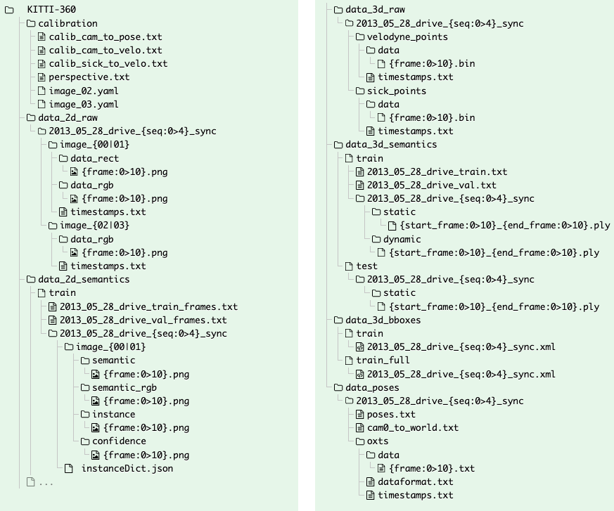
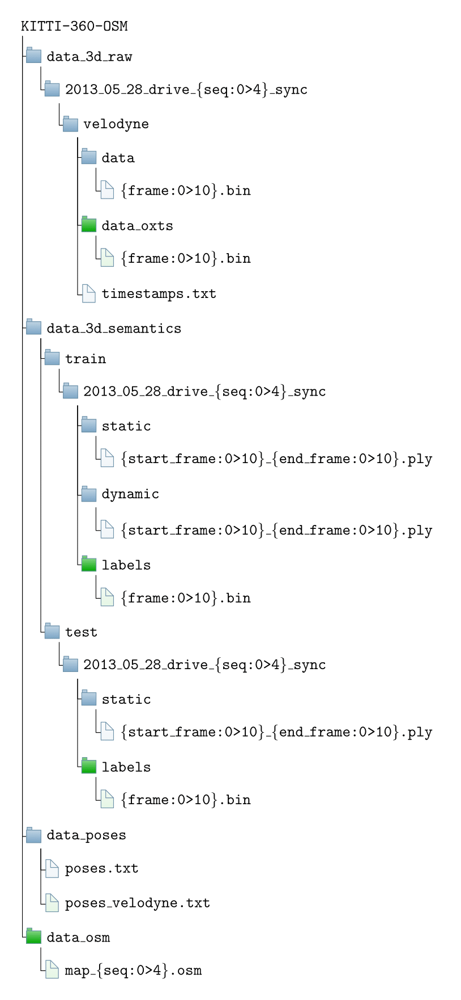

# DiffuOSM

This repository contains the scripts used for data extraction, experimental testing, and model training for the DiffuOSM research project.

Specifically it has:

1) Code to extract needed data for training the DiffuOSM model from KITTI-360, as well as data collected on the CU Boulder campus.
2) Code to interact with extracted data.
3) Code for training and testing the diffusion model.
4) A ROS1 (ROS2 coming soon) package that allows for a user to use the DiffuOSM model alongside lidar-based SLAM.

## Resulting extracted data

The data that is extracted is done per lidar scan and is centered about the lidar's frame, translated to the current scan's estimated pose. Each scan extracts building data:

1) The OSM building polygons belonging to buildings that have been scanned by more than 100 lidar points.
2) The total set (over entire sequence) of accumulated points observed for each building in current lidar frame.
   1) total_accum_points = append({observed_points}) for all scans in sequence
3) The current set (up to this scan) of accumulated points observed for each building in current lidar frame.
4) The current set (up to this scan) of unobserved points for each building in current lidar frame.
   1) {total accum} - {current accum obs}
5) The total unobserved.1=
   1) {total accum} - {current obs}

## Dataset Adjustments from original

This fork of the scripts for the KITTI360 dataset contain the following additions:

1) A directory with a python-based implementation to extract per-scan labels for each frame. This is in the 'recoverKITTI' directory.

2) A directory that contains Python scripts to overlay OSM-data with lidar scans. There is also addition code so that for each sequence, points that intersect a building polygon's edges will be extracted for points with the 'building' label and for points with the 'unlabeled' label. This directory is still actively being modified, so further documentation will be added soon.

This fork of the kitti360scripts repository has been modified to help obtain data to align Velodyne scans to OpenStreetMaps-based geodata. To view the modified KIITI-360 data, you can download it from here [].

### The original KITTI-360 folder structure is as follows:

#### Note from the authors: "The full dataset including raw data, semantic and instance labels in both 2D & 3D is structured as follows, where {seq:0>4} denotes the sequence ID using 4 digits and {frame:0>10} denotes the frame ID using 10 digits."

Dataset structure and data formats are available at: www.cvlibs.net/datasets/kitti-360/documentation.php




### The modified folder structure of KITTI-360 (KITTI-360-OSM) looks like:

#### Here, some of the folders and internal files from the original KITTI-360 dataset were removed. Only the files that are planned to be used in this work were kept. All folders and files with a green color are new and were generated using the code here (besides the OSM files). 




--- 


# The KITTI-360 Dataset

This repository contains scripts for inspection of the KITTI-360 dataset. This large-scale dataset contains 320k images and 100k laser scans in a driving distance of 73.7km.  We annotate both static and dynamic 3D scene elements with rough bounding primitives and transfer this information into the image domain, resulting in dense semantic & instance annotations on both 3D point clouds and 2D images.

Details and download are available at: www.cvlibs.net/datasets/kitti-360

## Scripts

### Installation

Install `kitti360Scripts` with `pip`
```
pip install git+https://github.com/autonomousvision/kitti360Scripts.git
```

For the 2D graphical tools you additionally need to install
```
sudo apt install python-tk python-qt5
```

We use open3D to visualize 3D point clouds and 3D bounding boxes:
```
pip install open3d
```

### Usage

This scripts contains helpers for loading and visualizing our dataset. For inspection, please download the dataset and add the root directory to your system path at first:

```
export KITTI360_DATASET=/PATH/TO/THE/DATASET
```

You can inspect the 2D images and labels using the following tool:
```
cd kitti360scripts/viewer
python kitti360Viewer.py
```

You can visualize the 3D fused point clouds and labels using the following tool:
```
cd kitti360scripts/viewer
python kitti360Viewer3D.py -sequence ${sequence}
```

### Package Content

The package is structured as follows
 - `helpers`: helper files that are included by other scripts
 - `viewer`: view the 2D image & labels and the 3D fused point clouds & labels

Note that all files have a small documentation at the top. Most important files
 - `helpers/labels.py`: central file defining the IDs of all semantic classes and providing mapping between various class properties.
 - `helpers/annotations.py`: central file containing the loaders for all labels including 3D bounding boxes and fused point clouds

## Acknowledgment

The 2D graphical tool is adapted from Cityscapes. 

## Reference

If you find this code or our dataset helpful in your research, please use the following BibTeX entry.

```
@article{Liao2021ARXIV, 
   title   = {{KITTI}-360: A Novel Dataset and Benchmarks for Urban Scene Understanding in 2D and 3D}, 
   author  = {Yiyi Liao and Jun Xie and Andreas Geiger}, 
   journal = {arXiv preprint arXiv:2109.13410},
   year    = {2021}, 
}
```

## Contact

Please feel free to contact us with any questions, suggestions or comments:

* Yiyi Liao, Andreas Geiger 
* yiyi.liao@tue.mpg.de, a.geiger@uni-tuebingen.de
* www.cvlibs.net/datasets/kitti-360 

## License

Our __utility scripts__ in this repository are released under the following MIT license. 

---

MIT License

Copyright (c) 2021 Autonomous Vision Group

Permission is hereby granted, free of charge, to any person obtaining a copy of this software and associated documentation files (the "Software"), to deal in the Software without restriction, including without limitation the rights to use, copy, modify, merge, publish, distribute, sublicense, and/or sell copies of the Software, and to permit persons to whom the Software is furnished to do so, subject to the following conditions:

The above copyright notice and this permission notice shall be included in all copies or substantial portions of the Software.

THE SOFTWARE IS PROVIDED "AS IS", WITHOUT WARRANTY OF ANY KIND, EXPRESS OR IMPLIED, INCLUDING BUT NOT LIMITED TO THE WARRANTIES OF MERCHANTABILITY, FITNESS FOR A PARTICULAR PURPOSE AND NONINFRINGEMENT. IN NO EVENT SHALL THE AUTHORS OR COPYRIGHT HOLDERS BE LIABLE FOR ANY CLAIM, DAMAGES OR OTHER LIABILITY, WHETHER IN AN ACTION OF CONTRACT, TORT OR OTHERWISE, ARISING FROM, OUT OF OR IN CONNECTION WITH THE SOFTWARE OR THE USE OR OTHER DEALINGS IN THE SOFTWARE.

---

Our __datasets__ and __benchmarks__ are copyright by us and published under the [Creative Commons Attribution-NonCommercial-ShareAlike 3.0 License](https://creativecommons.org/licenses/by-nc-sa/3.0/). This means that you must attribute the work in the manner specified by the authors, you may not use this work for commercial purposes and if you alter, transform, or build upon this work, you may distribute the resulting work only under the same license.

